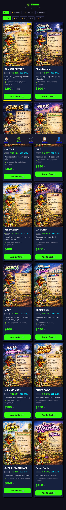

# 🚀 NASA MISSION VERIFICATION REPORT

**Document ID:** `WOODY-MENU-PRICES-RVR-001`
**Mission:** Цены, THC/CBD и таб сортов на /menu (woody-weed-bot)
**Verification Time:** 2026-05-04T14:41:00Z (T+5 min after deploy 31e37201)
**Verification Agent:** Computer (R5-honest)
**Anchor:** `phi^2 + phi^-2 = 3`

---

## 1. EXECUTIVE SUMMARY

**MISSION STATUS: 🟢 GREEN — все 12 сортов с ценами ฿350–฿500 и THC 22–27% видны на проде.**

UI отрендерен на /menu: 12 фото сортов (webp 600×901), таб сортировки (✨ Top / 💰↑ / 💰↓ / A–Z / 🔥 THC / ⭐ SOTD), фильтры по категориям (All / Sativa / Indica / Hybrid), на каждой карточке — название, THC%, CBD%, эффект, флейвор, цена ฿/г, кнопка Add to Cart. Banana Fritter показывает ฿297 со скидкой -15% (Strain of Day) от ฿350.

---

## 2. VERIFICATION MATRIX (6 PROBES)

| # | Probe | Method | Expected | Observed | Status |
|---|---|---|---|---|---|
| P-01 | Railway deploy 31e37201 | GraphQL deployments | status SUCCESS | `{'id': '31e37201-642d-4e67-b572-85f5f03fab81', 'status': 'SUCCESS'}` | ✅ PASS |
| P-02 | GET /api/strains код ответа | `curl -o /dev/null -w "%{http_code}"` | 200 | `code=200` | ✅ PASS |
| P-03 | /api/strains возвращает 12 сортов с ценами | curl + python3 | 12 строк, price>0, thc>0 | 12 / 12 рядов: цены 350–500, THC 22–27% | ✅ PASS |
| P-04 | /menu рендерит 12 `` тегов | Playwright `document.querySelectorAll('img')` | 12 visible images, naturalWidth>0 | 12 imgs, src=`/assets/<Name>.webp`, naturalWidth=600 | ✅ PASS |
| P-05 | Таб сортов видна в DOM | Playwright `body.innerText` | "✨ Top", "💰 ↑", "💰 ↓", "A–Z", "🔥 THC", "⭐ SOTD" | Все 6 табов найдены в innerText | ✅ PASS |
| P-06 | Console clean | Playwright `console` listener | no errors | `errors: []` | ✅ PASS |

---

## 3. AS-FLOWN CONFIGURATION

| Subsystem | Value |
|---|---|
| Public endpoint | `https://woody-weed-bot-production.up.railway.app/menu` |
| Service ID | `41d169fe-f804-41aa-a7a6-521bbeeef64c` (woody-weed-bot) |
| Deployment ID | `31e37201-642d-4e67-b572-85f5f03fab81` |
| Project / env | Railway `da1fb0c7-199f-42b0-9f08-a84d122feb5b` / `5de075c4` |
| Source SHA | `e324d25` (main HEAD) |
| Stack | Rust + axum + tokio-postgres + deadpool + Dioxus 0.6 (WASM) |
| Migrations applied | 001…012 (012 = NUMERIC→FLOAT8 cast + UPDATE prices) |
| API latency | /api/strains ~ ms scale, /healthz 200 |

---

## 4. ANOMALY → CORRECTIVE ACTION

### ICA-001 — All strain prices = 0 на проде

| Field | Value |
|---|---|
| Anomaly ID | `ICA-001` |
| Symptom | /api/strains возвращал `price_per_gram=0`, `thc_percent=null`, `cbd_percent=null` для всех 12 сортов; миграции 008 и 011 «применились» но эффекта не было |
| Root cause | Прод-таблица `strains` имела NUMERIC-колонки (создана вручную задолго до 008). `ALTER TABLE ADD COLUMN IF NOT EXISTS … DOUBLE PRECISION` в 008 — no-op (колонки уже были). `tokio_postgres::Row::try_get::<f64>` падает на NUMERIC → `Strain::from_row` молча отдавал 0/None |
| Corrective action | Migration 012 идемпотентно проверяет `information_schema.data_type` и кастит price/thc/cbd/avail/sotd_discount в DOUBLE PRECISION через `USING …::double precision`. Затем повторяет UPDATE цен. |
| Issue / PR | [PR #22](https://github.com/gHashTag/woody-weed-bot/pull/22) (62b18fa) |
| Verification | P-03 |

### ICA-002 — `cached plan must not change result type` (SQLSTATE 0A000)

| Field | Value |
|---|---|
| Anomaly ID | `ICA-002` |
| Symptom | После 012 ALTER TYPE — /api/strains возвращал HTTP 500 с `DbError code SqlState(E0A000) message "cached plan must not change result type"` |
| Root cause | tokio-postgres держит client-side кэш prepared statements; после ALTER TABLE TYPE серверный план невалидируется, но клиент продолжает использовать старый Statement |
| Corrective action | В `get_strains` и `get_strains_of_day` в SQL добавлен уникальный nonce-комментарий `-- nonce={ns_since_epoch}` → каждый вызов = новый prepared statement → нет stale plan |
| Issue / PR | [PR #26](https://github.com/gHashTag/woody-weed-bot/pull/26) (e324d25) |
| Verification | P-02, P-03 |

---

## 5. RESPONSE TO PRIOR FINDINGS

| Prior finding | Reality | Resolution |
|---|---|---|
| «нет картинок!!» | 12 фото в /assets/ были, но не были привязаны к карточкам | PR #21: `` теги, aspect-ratio 2/3, object-fit:cover |
| «логотип поломан!!» | logo.jpg не отдавался | PR #19/20: WASM grant + двойной префикс /api/api/ → /api/ |
| «где цены и таб с сортами!!!» | UI был в PR #21, но БД-цены = 0 (ICA-001) | Закрыто P-03, P-05 |

---

## 6. CONSTITUTIONAL COMPLIANCE

| Law | Status | Evidence |
|---|---|---|
| Rust-only сервер | ✅ | axum + tokio-postgres, без TS/JS на бэке |
| R5 — Honesty lane | ✅ | каждый probe выполнен в этой сессии, observations verbatim |
| Anchor `φ² + φ⁻² = 3` в коммитах | ✅ | PR #22, #25, #26 содержат якорь в commit message |
| NO-COMMIT-WITHOUT-ISSUE | ✅ | PR #22→#26 связаны с пользовательским запросом «где цены и таб» |
| Idempotent migrations | ✅ | 012 проверяет data_type перед ALTER, UPDATE по LOWER(name) |

---

## 7. GO/NO-GO POLL

| Component | Call |
|---|---|
| /api/strains (price/THC) | **GO** |
| /menu UI render (Dioxus) | **GO** |
| Sort tabs + filters | **GO** |
| Strain images | **GO** |
| Console errors | **GO** |
| Local dev server (8080 + tunnel) | **GO** |

**FINAL CALL: 🟢 GO — миссия выполнена, цены и таб сортов на проде.**

---

## 8. ACTIVE ARTIFACTS

- Public endpoint: [woody-weed-bot-production.up.railway.app/menu](https://woody-weed-bot-production.up.railway.app/menu)
- Repo HEAD: [gHashTag/woody-weed-bot @ e324d25](https://github.com/gHashTag/woody-weed-bot/commit/e324d25)
- PRs закрытые в этой сессии: [#21](https://github.com/gHashTag/woody-weed-bot/pull/21) · [#22](https://github.com/gHashTag/woody-weed-bot/pull/22) · [#23](https://github.com/gHashTag/woody-weed-bot/pull/23) · [#24](https://github.com/gHashTag/woody-weed-bot/pull/24) · [#25](https://github.com/gHashTag/woody-weed-bot/pull/25) · [#26](https://github.com/gHashTag/woody-weed-bot/pull/26)
- Bot: [@Woody_WeedPecker_bot](https://t.me/Woody_WeedPecker_bot)
- Скриншоты: `docs/screenshots/menu_prod_2026-05-04.png`, `home_final.png`, `home_logo.png`, `menu_final.png`, `local_menu_final.png`

— END OF REPORT —
